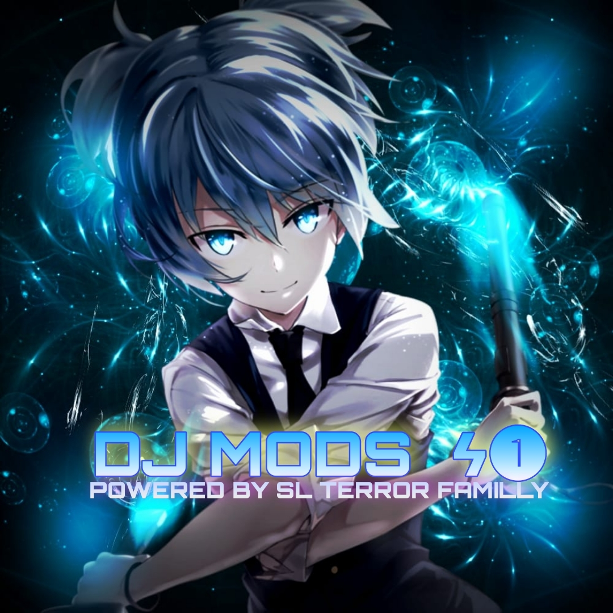

* ShadowndsBot.v2 
* ©by berserker09

<p align="center">

</p>
<p align="center">
    
    
</p>

<p align="center">
<a href="https://github.com/shanduy"></a>
</p>
<p align="center">
<a href="#"></a>
</p>
<p align="center">

</p>

# Instalacion

## Para no tener ningún problema usa:
```bash
>termux-change-repo
(Seleccionan todas las opciones que les aparescan en la primera ventana/En la segunda ventana seleccionan la opcion que contenga la letra 'grimler'

>termux-setup-storage
(da el permiso a almacenamiento)
```

### Inicia la Instalacion:

```bash
>pkg update && pkg upgrade
>pkg install git
>pkg install nodejs
>git clone https://github.com/berserker09/ShadowndsBot.v2
>cd ShadowndsBot.v2
>bash install.sh
```

#### Para iniciar el bot usa:
```bash
>npm start
```
## Agradecido con el de arriba y a estos cracks :3

* <a href="https://github.com/adiwajshing/Baileys">
* <a href="https://github.com/Samu330/NyanBot">
## Grupo de WhatsApp
PSDT: Grupo de WhatsApp soporte del bot y ayuda 
* <a href="https://chat.whatsapp.com/E5xoSThB6LQ5L6CY8XrODI"></a>
